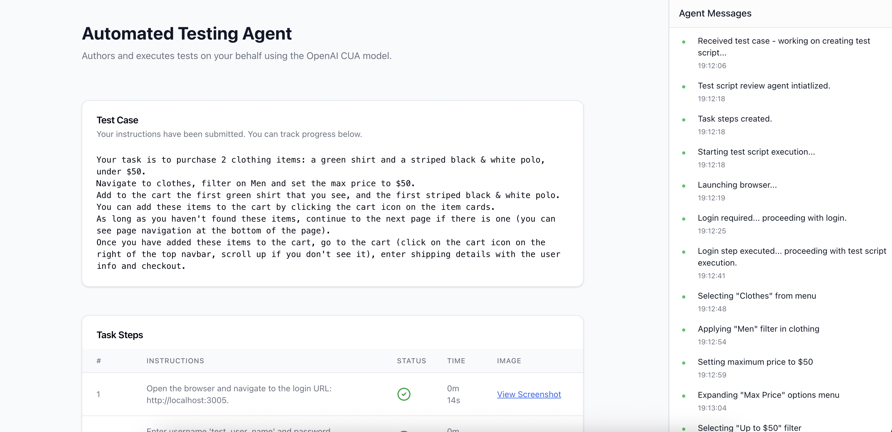

# Testing Agent Demo

[](frontend/LICENSE)

This monorepo demonstrates how you can use OpenAI's CUA model and [computer use tool](https://platform.openai.com/docs/guides/tools-computer-use) to automate frontend testing. It uses [Playwright](https://playwright.dev) to spin up a browser instance and navigate to the web app to be tested. The CUA model then follows the provided test case and executes actions on the interface until the test case is done.  

The repo contains three applications that work together:

- **frontend** – Next.js web interface used to configure tests and watch them run.
- **cua-server** – Node service that communicates with the OpenAI CUA model and drives Playwright to interact in a browser with the sample app.
- **sample-test-app** – Example e‑commerce site used as an example app to test by the agent.



> [!CAUTION]  
> Computer use is in preview. Because the model is still in preview and may be susceptible to exploits and inadvertent mistakes, we discourage trusting it in authenticated environments or for high-stakes tasks.

## How to use

1. **Clone the repository**

   ```bash
   git clone https://github.com/openai/testing-agent-demo
   cd testing-agent-demo
   ```

2. **Prepare environment files**

   If you haven't set your `OPENAI_API_KEY` environment variable on your terminal or globally on your machine (set up instructions [here](https://platform.openai.com/docs/libraries#create-and-export-an-api-key)), edit each `.env.development` file and set `OPENAI_API_KEY`.

   ```bash
   cp frontend/.env.example frontend/.env.development
   cp cua-server/.env.example cua-server/.env.development
   cp sample-test-app/.env.example sample-test-app/.env.development
   ```

   The sample app also defines demo login credentials, which by default are:

   ```bash
   ADMIN_USERNAME=test_user_name
   ADMIN_PASSWORD=test_password
   ```

   Make sure you add a `sample-test-app/.env.development` file with the example credentials to run the demo.

3. **Install dependencies**

   ```bash
   npm install
   npx playwright install
   ```

4. **Run all apps**

   ```bash
   npm run dev
   ```

   This will start all three apps:

   - Frontend UI: http://localhost:3000
   - Sample app: http://localhost:3005
   - CUA server: [ws://localhost:8080](http://localhost:8080)

   Navigate to [localhost:3000](http://localhost:3000) to see the frontend UI and run the demo.

For details on each app see their READMEs:

- [frontend/README.md](frontend/README.md)
- [cua-server/README.md](cua-server/README.md)
- [sample-test-app/README.md](sample-test-app/README.md)

## Customization

You can use this testing agent with any web app you choose, and update the test case and target URL either in the config UI or in the `frontend/lib/constants.ts` file (default values used in the UI).

`sample-test-app` is only provided as an example to try the demo, and `frontend` as a testing interface. The core logic of the testing agent is in `cua-server`, which is what you might want to bring into your own application.

## Contributing

You are welcome to open issues or submit PRs to improve this app, however, please note that we may not review all suggestions.

## Security Notes

- This project is meant to be used on test environments only.
- Do not use real user data in production.

## License

This project is licensed under the MIT License. See the [LICENSE](LICENSE) file for details.
